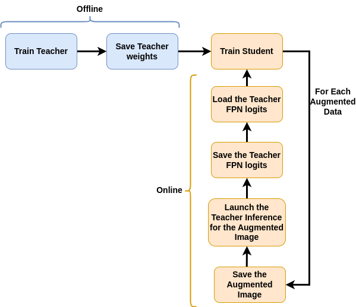
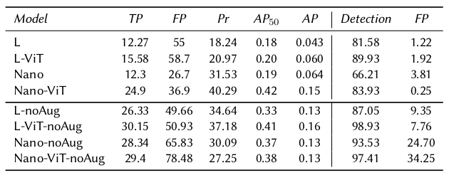

# KD-YOLOX-ViT
This repository holds the code for the Python implementation of YOLOX-ViT (TODO). Furthermore, it has the implementation of the Knowledge Distillation (KD) method, evaluation metrics of the object detector and the side-scan sonar image dataset for underwater wall detection.

The Sonar Wall Detection Dataset (SWDD) is publicly accessible at: https://zenodo.org/records/10528135.

The base of the code comes from the YOLOX repository: https://github.com/Megvii-BaseDetection/YOLOX/tree/main

## Contributions

This code has two primary contributions:
- **ViT Layer Integration**: Implementing a Vision Transformer (ViT) layer between the Neck and the Backbone to enhance the feature extraction process. This integration aims to leverage the strengths of ViT in understanding global dependencies within images, thereby improving feature representation capabilities beyond conventional CNN architectures.
  
- **Knowledge Distillation Enhancement**: Implementing Knowledge Distillation between a Teacher model (e.g., YOLOX-L) and a Student model (YOLOX-Nano) to improve the accuracy of the Student model. This process involves transferring knowledge from the larger, more complex Teacher model to the smaller, more efficient Student model, thereby enhancing its performance without significantly increasing computational costs.


## Knowledge Distillation
The following image introduces the Knowledge Distillation principle used for the KD-YOLOX-ViT.


Object detection loss function is characterized by:
- **Classification loss** improves classification accuracy, 
- **Interval over Union (IoU) loss** enhances the precision of object localization,
- **Objectness loss** refines the model's ability to identify regions containing objects

Which gives the loss function: 

$$L_{total} = \lambda_{cls} \cdot L_{cls} + \lambda_{iou} \cdot L_{iou} + \lambda_{obj} \cdot L_{obj}$$

Where $\lambda_{cls}$, $\lambda_{iou}$, $\lambda_{obj}$ are the losses weights.


Since, the $L_{total}$ is based on Ground Truth, we will call it $L_{hard}$, for hard loss.

Knowledge Distillation aims to implement a new loss fucntion called $L_{soft}$, for soft loss, which is the loss function between the Student prediction and the Teacher inference output.

Thus, the Knowldge Distillation output is:
$$\mathcal{L} = \lambda * \mathcal{L}_{\text{hard}} + (1 - \lambda) * \mathcal{L}_{\text{soft}}$$ 
with $\lambda$ as a parameter regularizing the hard and soft loss terms.

## Knowledge Distillation - YOLOX
YOLOX is an anchor-free object detection model with decoupled head. It uses an online random data augmentation which improve the robustness and accuracy of the model.
Knowledge Distillation use the Teacher inference output as a $L_{soft}$.
### Online Knowledge Distillation
Thus, for implementing Knowledge Distillation into YOLOX the Teacher need to launch the inference with random data augmented for each training batch. This workflow is characterize in the image below.   



Lets choose as example the YOLOX-L as Teacher and YOLOX-nano as Student.

1. The following command run the YOLOX-L model
```shell
python3 tools/train.py -f exps/default/yolox_l.py -b 8 --fp16 --logger wandb
```
or the following command using pre-trained weights 
```shell
python3 tools/train.py -f exps/default/yolox_l.py -b 8 -c datasets/COCO/weight/yolox_l.pth --fp16 --logger wandb
```

2. The weights should be automatically saved under the folder /YOLOX_OUTPUTS/yolox_l/

3. Before launching the YOLOX-nano model, the YOLOX-nano file needs to be modified for Knowledge Distillation under /exps/default/yolox_nano.py. The parameters $\it{self.KD}$ and $\it{self.KD\_online}$ need to be set to $\bold{True}$. Finally the $\it{self.folder\_KD\_directory}$ is the repository where the images and Teacher FPN logits are saved.  


4. The following command run the YOLOX-nano model
```shell
python3 tools/train.py -f exps/default/yolox_nano.py -b 8 --fp16 --logger wandb
```
or the following command using pre-trained weights 
```shell
python3 tools/train.py -f exps/default/yolox_nano.py -b 8 -c datasets/COCO/weight/yolox_nano.pth --fp16 --logger wandb
```

During the Student training, the model saves the augmented images, launch the Teacher inference, save and load the FPN logits, calculate the $L_{soft}$, and finally add the $L_{soft}$ to the $L_{hard}$. 

However, because of the online Teacher inference, the training can take lot of time. For instance for the [SWDD](https://zenodo.org/records/10528135) dataset recquires one week for training 300 epochs on a single GPU Geforce RTX 3070 Ti. 

### Offline Knowledge Distillation
Because of the time consuming for online Knowledge Distillation, we also proposed an offline version which drastically reduce the training time. The aim of the Offline Knowledge Distillation is to disable the online data augmentation, and train the Student using the dataset. However, the Teacher can still be trained using online data augmentation.    
The offline Knowledge Distillation workflow is detailled below.


1. The first steps $\it{Train}$ $\it{Teacher}$, and $\it{Save}$ $\it{teacher}$ $\it{weights}$ use the same command as for Online Knowledge Distillation
2. Launch the Teacher Inference using the trained weights by running the following command:
```shell
python3 Teacher_Inference.py
```
The weights repository can be modified accordingly in the Teacher_Inference.py file. Furthermore, becaue YOLOX-nano only use image size of 416 $\times$ 416, the Teacher inference needs to be launch with the same image size. This can also be modified in the Teacher_Inference.py file.

3. Same as for the Online Knowledge Distillation, before launching the YOLOX-nano file needs to be modified for Knowledge Distillation under /exps/default/yolox_nano.py. Set $\it{self.KD}$ to $\bold{True}$, however, set the $\it{self.KD\_online}$ to $\bold{False}$, which indicate the Knowledge Distillation in offline mode.   

4. Finally, the YOLOX-nano training can be launch with 
```shell
python3 tools/train.py -f exps/default/yolox_nano.py -b 8 --fp16 --logger wandb
```
or the following command using pre-trained weights 
```shell
python3 tools/train.py -f exps/default/yolox_nano.py -b 8 -c datasets/COCO/weight/yolox_nano.pth --fp16 --logger wandb
```

## YOLOX-ViT
Transformers, introduced by Vaswani et al. ([Attention Is All You Need](https://proceedings.neurips.cc/paper_files/paper/2017/file/3f5ee243547dee91fbd053c1c4a845aa-Paper.pdf)), initially designed for natural language processing, proved effective in handling sequential data, outperforming the state-of-the-art. Dosovitskiy et al. ([An image is worth16x16 words: Transformers for image recognition at scale](https://api.semanticscholar.org/CorpusID:225039882)) introduced the Visual Transformer called ViT, the first computer vision transformer model, achieving state-of-the-art performance on image recognition tasks without convolutional
layers. Carion et al. ([End-to-End Object Detection with Transformers](https://link.springer.com/chapter/10.1007/978-3-030-58452-8_13)) presented DETR (DEtection TRansformer) for object detection directly predicting sets, without the need of separate region proposal and refinement stages. Integrating transformers with CNNs enhances feature extraction in object detection tasks, combining the spatial hierarchy of CNNs with the global context of transformers. Yu et al. ([Real-time underwater maritime object detection in side-scan sonar images based on transformer-yolov5](https://www.mdpi.com/2072-4292/13/18/3555)) proposed a YOLOv5-TR for containers and shipwreck detection. Aubard et al. ([Real-time automatic wall detection and localization based on side scan sonar images](https://ieeexplore.ieee.org/document/9965813)) demonstrated a 5.5% performance improvement using YOLOX. This section enhances the YOLOX model by incorporating a transformer layer between the backbone and neck at the end of the SPPBottleneck layer for improved feature extraction capability. The ViT layer is set up with 4 Multi-Head Self-Attention (MHSA) layers. The following image shows the ViT layer integration into the YOLOX model.


<!-- ## Experimental Results
### YOLOX - YOLOX-ViT Comparison
This Experimental Results is divided into two different experiments.
The first experiment compares the basic YOLOX architecture with the YOLOX-Vit model using the [SWDD](https://zenodo.org/records/10528135) dataset, which is represented on the following table. They are both comapred with and whithout online data augmentation (called "-noAug").


 
$\textit{TP}$ and $\textit{FP}$ are, respectively, the True and False positive percentages over the extracted video images. $\textit{Pr}$ is the precision of the detection based on the proportion of correctly identified objects among all detections, with precise bounding box placement. In contrast, Average Precision at 50\% IoU ($\textit{AP}_{50}$) evaluates the balance between precision and recall (proportion of actual objects correctly identified by the model, again considering the accuracy of the bounding box positioning), thereby providing a comprehensive assessment of the model’s ability to accurately detect objects, ensure correct bounding box alignment, and minimize false positives and negatives. $\textit{AP}_{50}$ average precision at an Intersection over Union (IoU) threshold of 0.5 where the AP considers a range of IoU thresholds from 0.5 to 0.95. $\textit{Detection}$ on video quantifies the duration, manually timed, where the model correctly detects a wall when it is in the video. $\textit{FP}$ on video denotes the count of false positive detections, indicating instances where the model incorrectly identified a wall during the video inference.

The experiment is divided into two parts, as detailed in Section 4. The first
part involves training with online random data augmentation, while the second part proceeds without it. The comparative analysis of the L and L-ViT models, particularly in the experiments with extracted images, reveals some limitations. The metrics for L and L-ViT are inferior compared to L-noAug and L-ViT-noAug, indicating that the models perform better without online data augmentation. This suggests that the limited dataset size may adversely impact the performance of larger models like YOLOX-L. However, visual experiments demonstrate that YOLOX-L-ViT offers superior detection performance. Additionally, integrating the ViT layer enhances the basic YOLOX model’s capabilities. It boosts video
detection by approximately 8% with L, and 23% for Nano. However, visual interpretations indicate that the ViT-enhanced models underperform relative to their basic architecture without online data augmentation. While detection rates increased, so did false positives, suggesting that the models may overly generalize bright objects as walls.

### Knowledge Distillation - Results
The following table shows the results using Knowledge Distillation for improving the Student accuracy, and compares the Knowledge Distillation on the basic YOLOX architecture and the YOLOX-Vit version.


It demonstrates that KD effectively decreased the False Positive rate. Additionally, the ViT layer further reduced False Positives in the student models. Specifically, for Nano-noAug, the basic model lowered False Positives by about 0.3%, whereas the ViT variant reduced by ∼6%. The Nano-ViT-noAug, with the basic model as a teacher, cut False Positives by ∼12.95%, and the ViT version managed a reduction of about 20.35%. -->